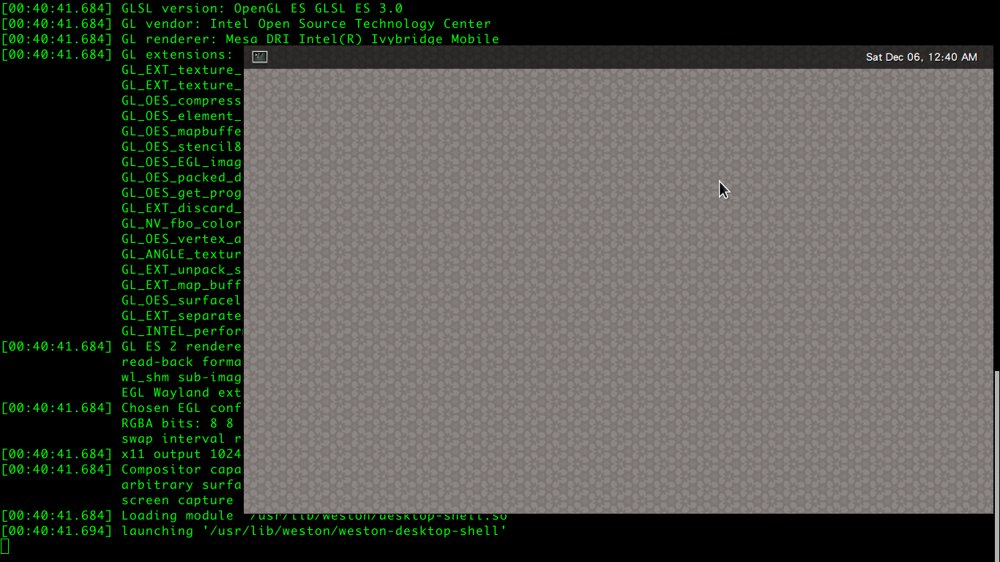
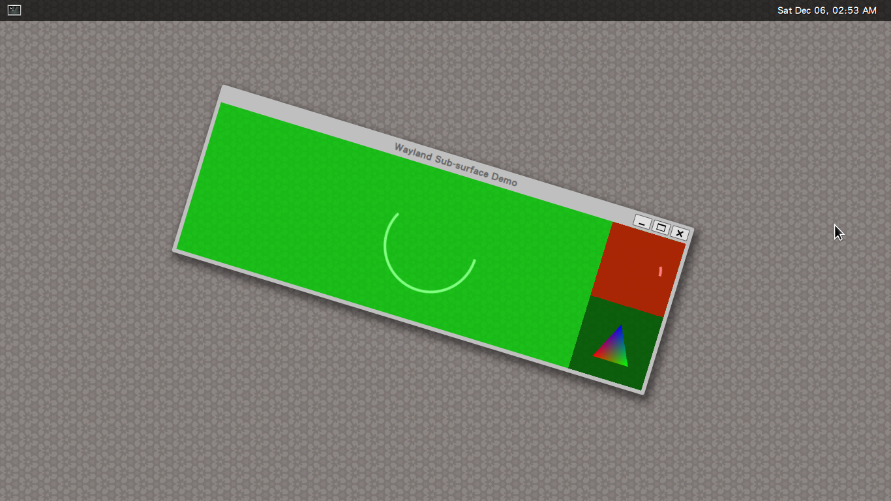
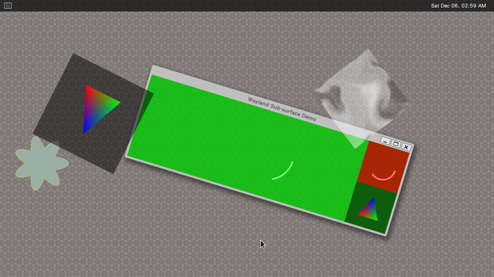
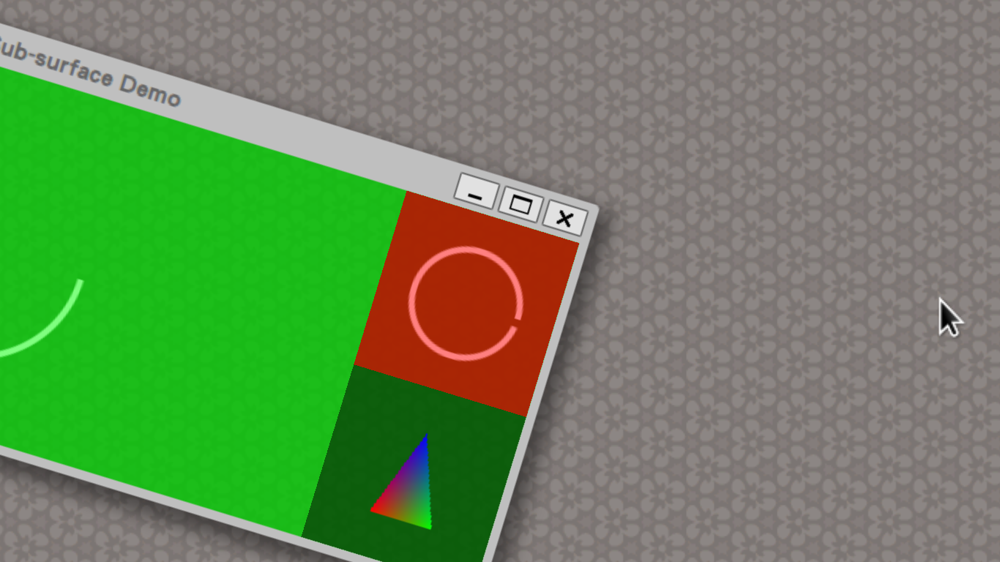

========================================
Wayland Resources
========================================

- `Wayland Website <http://wayland.freedesktop.org/>`_
- `Wayland Documentation <http://wayland.freedesktop.org/docs/html/index.html>`_
- `Wayland - ArchWiki <https://wiki.archlinux.org/index.php/wayland>`_

Install
========================================

From ArchWiki
------------------------------

Currently Wayland will only work on systems utilizing KMS.

Wayland is most likely installed on your system already, as it is an indirect dependency of gtk2 and gtk3.

::

    On my Arch Linux computer,
    I already have below shared library in my /usr/lib/ :

        libwayland-client.so
        libwayland-cursor.so
        libwayland-egl.so
        libwayland-server.so

As Wayland is only a library, it is useless on its own. To replace X Server, you need a compositor (like Weston).

Install Weston
------------------------------

.. code-block:: sh

    # Arch Linux

    pacman -S weston

    # It will install
    #
    #   community/libunwind
    #   community/weston

After installed, you can use ``weston`` to run it inside a running X session,
or use ``weston-launch`` to run natively on a tty

.. code-block:: sh

    # run it inside a running X session
    weston

.. code-block:: sh

    # run it natively
    weston-launch

Message of starting weston :

::

    Date: 2014-12-05 CST
    [20:42:56.015] weston 1.6.0
                   http://wayland.freedesktop.org/
                   Bug reports to: https://bugs.freedesktop.org/enter_bug.cgi?product=Wayland&component=weston&version=1.6.0
                   Build: 1.5.93-5-g2858cc2 configure.ac: bump version to 1.6.0 (2014-09-19 13:40:14 +0300)
    [20:42:56.015] OS: Linux, 3.17.2-1-ARCH, #1 SMP PREEMPT Thu Oct 30 20:49:39 CET 2014, x86_64
    [20:42:56.015] Starting with no config file.
    [20:42:56.015] Loading module '/usr/lib/weston/x11-backend.so'
    [20:42:56.019] initializing x11 backend
    [20:42:56.020] Loading module '/usr/lib/weston/gl-renderer.so'
    [20:42:56.034] warning: EGL_EXT_buffer_age not supported. Performance could be affected.
    [20:42:56.034] warning: EGL_EXT_swap_buffers_with_damage not supported. Performance could be affected.
    [20:42:56.034] Using gl renderer
    [20:42:56.034] launching '/usr/lib/weston/weston-keyboard'
    [20:42:56.042] EGL version: 1.4 (DRI2)
    [20:42:56.042] EGL vendor: Mesa Project
    [20:42:56.042] EGL client APIs: OpenGL OpenGL_ES OpenGL_ES2 OpenGL_ES3
    [20:42:56.042] EGL extensions: EGL_MESA_drm_image EGL_MESA_configless_context
                   EGL_WL_bind_wayland_display EGL_KHR_image_base
                   EGL_KHR_image_pixmap EGL_KHR_image EGL_KHR_gl_texture_2D_image
                   EGL_KHR_gl_texture_cubemap_image EGL_KHR_gl_renderbuffer_image
                   EGL_KHR_surfaceless_context EGL_KHR_create_context
                   EGL_NOK_swap_region EGL_NOK_texture_from_pixmap
                   EGL_CHROMIUM_sync_control EGL_EXT_create_context_robustness
                   EGL_EXT_image_dma_buf_import EGL_NV_post_sub_buffer
    [20:42:56.042] GL version: OpenGL ES 3.0 Mesa 10.3.3
    [20:42:56.042] GLSL version: OpenGL ES GLSL ES 3.0
    [20:42:56.042] GL vendor: Intel Open Source Technology Center
    [20:42:56.042] GL renderer: Mesa DRI Intel(R) Ivybridge Mobile
    [20:42:56.042] GL extensions: GL_EXT_blend_minmax GL_EXT_multi_draw_arrays
                   GL_EXT_texture_filter_anisotropic
                   GL_EXT_texture_compression_dxt1 GL_EXT_texture_format_BGRA8888
                   GL_OES_compressed_ETC1_RGB8_texture GL_OES_depth24
                   GL_OES_element_index_uint GL_OES_fbo_render_mipmap
                   GL_OES_mapbuffer GL_OES_rgb8_rgba8 GL_OES_standard_derivatives
                   GL_OES_stencil8 GL_OES_texture_3D GL_OES_texture_npot
                   GL_OES_EGL_image GL_OES_depth_texture
                   GL_OES_packed_depth_stencil GL_EXT_texture_type_2_10_10_10_REV
                   GL_OES_get_program_binary GL_APPLE_texture_max_level
                   GL_EXT_discard_framebuffer GL_EXT_read_format_bgra
                   GL_NV_fbo_color_attachments GL_OES_EGL_image_external
                   GL_OES_vertex_array_object GL_ANGLE_texture_compression_dxt3
                   GL_ANGLE_texture_compression_dxt5 GL_EXT_texture_rg
                   GL_EXT_unpack_subimage GL_NV_draw_buffers GL_NV_read_buffer
                   GL_EXT_map_buffer_range GL_OES_depth_texture_cube_map
                   GL_OES_surfaceless_context GL_EXT_color_buffer_float
                   GL_EXT_separate_shader_objects GL_EXT_shader_integer_mix
                   GL_INTEL_performance_query
    [20:42:56.042] GL ES 2 renderer features:
                   read-back format: BGRA
                   wl_shm sub-image to texture: yes
                   EGL Wayland extension: yes
    [20:42:56.042] Chosen EGL config details:
                   RGBA bits: 8 8 8 8
                   swap interval range: 0 - 1000
    [20:42:56.042] x11 output 1024x640, window id 29360133
    [20:42:56.042] Compositor capabilities:
                   arbitrary surface rotation: yes
                   screen capture uses y-flip: yes
    [20:42:56.043] Loading module '/usr/lib/weston/desktop-shell.so'
    [20:42:56.049] launching '/usr/lib/weston/weston-desktop-shell'

Keyboard Shortcuts (super = windows key - can be changed, see weston.ini) :

+-------------------------------------+------------------------------------------+
| Cmd                                 | Action                                   |
+=====================================+==========================================+
| Ctrl + Alt + Backspace              | Quit Weston                              |
+-------------------------------------+------------------------------------------+
| Super + Scroll (or PageUp/PageDown) | Zoom in/out of desktop                   |
+-------------------------------------+------------------------------------------+
| Super + Tab                         | Switch windows                           |
+-------------------------------------+------------------------------------------+
| Super + LMB                         | Move Window                              |
+-------------------------------------+------------------------------------------+
| Super + MMB                         | Resize Window                            |
+-------------------------------------+------------------------------------------+
| Super + RMB                         | Rotate Window !                          |
+-------------------------------------+------------------------------------------+
| Super + K                           | Force Kill Active Window                 |
+-------------------------------------+------------------------------------------+
| Super + KeyUp/KeyDown               | Switch Prev/Next Workspace               |
+-------------------------------------+------------------------------------------+
| Super + Shift + KeyUp/KeyDown       | Grab Current Window and Switch Workspace |
+-------------------------------------+------------------------------------------+
| Super + Fn                          | Switch to Workspace n                    |
+-------------------------------------+------------------------------------------+
| Super + S                           | Take a screenshot                        |
+-------------------------------------+------------------------------------------+
| Super + R                           | Record a screencast.                     |
+-------------------------------------+------------------------------------------+

Rotate

Zoom in

